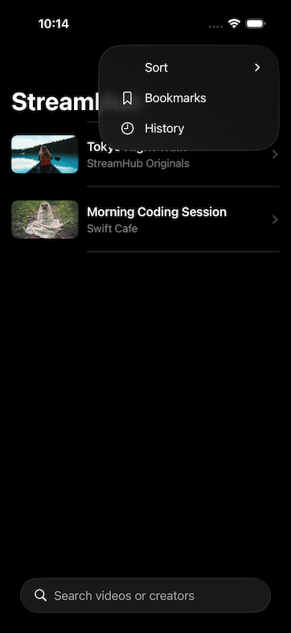
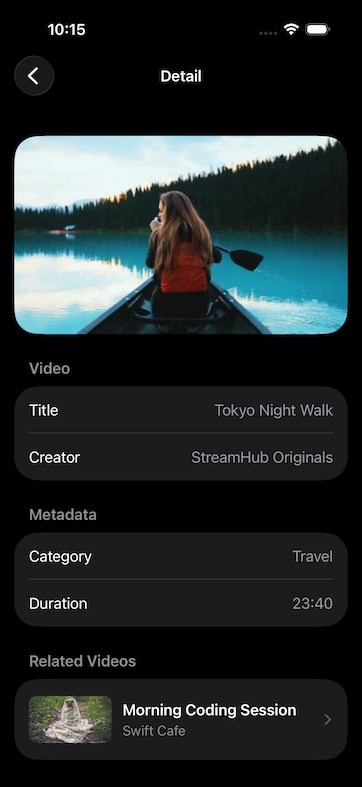
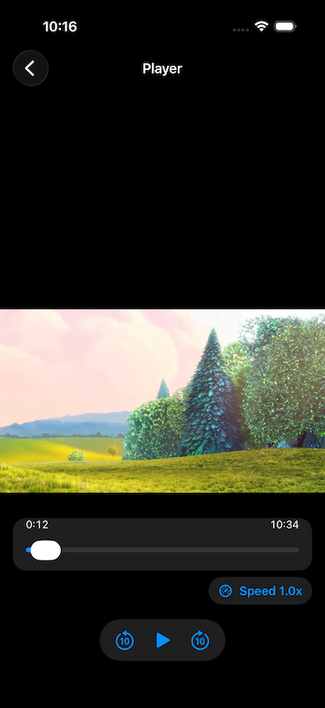

# StreamHub


## 📘 Overview

StreamHub is a SwiftUI-based video app project for iOS portfolio use. It focuses on production-like architecture and extensibility rather than visual polish.

## Purpose

- Show practical iOS skills around video features
- Demonstrate architecture decisions with clear separation of responsibilities
- Keep implementation testable from early stages

## Tech Stack

- SwiftUI
- async/await
- AVPlayer / AVKit
- MVVM
- Repository Pattern
- Constructor-based DI
- SwiftData (local persistence)
- Swift Testing (`import Testing`, `@Test`, `#expect`)

## Implemented Scope

- Home video list with `loading / empty / error / loaded` states
  - Search by title/creator
  - Sort options (`Default`, `Title A-Z`, `Title Z-A`)
  - Search empty-result state (`No Results`)
- Detail screen
  - Video metadata + lightweight category/duration section
  - Bookmark toggle
  - Related videos section (creator-priority ranking rule)
- Player screen
  - Play / Pause
  - Seek backward / forward 10 sec
  - Scrubber slider with current/duration labels
  - Buffering indicator while waiting for playback
  - Resume playback from saved position
  - Restart from beginning action
  - Playback speed control (`1.0x / 1.25x / 1.5x / 2.0x`)
  - Playback speed persistence across launches
  - Retry action on playback failure
- Bookmarks
  - List display
  - Swipe-to-remove
  - Sort options (`Recent`, `Title A-Z`)
- Playback History
  - List display (title/creator + played time)
  - Detail / Play Again actions from each history row
  - Swipe-to-remove
  - Clear all action
- Typed navigation foundation (`AppRoute`)
- Shared list-state UI and shared display formatter helpers

## Architecture Notes

- `View`: rendering and user interactions only
- `ViewModel`: state transitions and screen-level use cases
- `Domain`: core models and repository protocols
- `Data/Repositories`: mock + SwiftData reader implementations
- `Core/Storage`: persistence models (`BookmarkVideo`, `PlaybackHistory`)

### Project Structure

```text
StreamHub
├── App
├── Domain
├── Core
├── Data
├── Features
│   ├── Home
│   ├── Detail
│   ├── Player
│   ├── Bookmarks
│   ├── History
│   └── Shared
└── StreamHubTests
```

## Getting Started

1. Open `StreamHub.xcodeproj` in Xcode.
2. Select the `StreamHub` scheme.
3. Run on an iOS Simulator.

## Testing

All tests use Swift Testing.

- `MockVideoRepositoryTests`
- `HomeViewModelTests`
- `BookmarksViewModelTests`
- `PlaybackHistoryViewModelTests`
- `PlayerViewModelTests`
- `AppRouteTests`

Run from Xcode Test Navigator, or with `Product > Test`.

## Screenshots

<p align="center">
  
  
  
</p>

<p align="center">
  
  
</p>

## Requirements

- Xcode 26.x
- iOS Simulator 26.x
- Swift 6 (as configured by project settings)


# StreamHub
